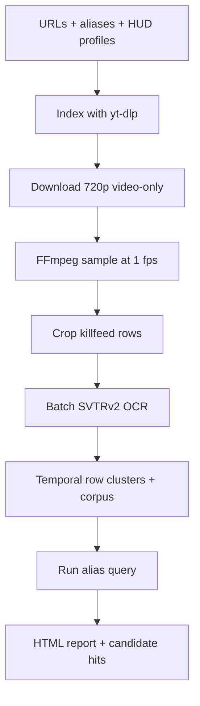

# TF2 YouTube Username Finder — MVP Design

Status: implementation handoff  
Primary MVP goal: find likely appearances of one player username (plus aliases) in TF2 gameplay videos and produce timestamps and evidence crops for human review.  
Long-term direction: scan a large video corpus once and let people search it for their own usernames.

## 1. Product definition

Given:

- a curated list of YouTube channels, playlists, or video URLs;
- a date range;
- one target username and optional historical aliases;
- a small amount of per-channel/HUD crop configuration;

the program downloads suitable video-only streams, samples the killfeed, recognizes each visible killfeed row with a small OCR model, matches the results against the target aliases, clusters repeated observations, and produces a reviewable report.

Success is not perfect killfeed transcription. Success is high recall for the target name with few enough candidates that a person can quickly verify them.

The scanner must remain **target-independent** even though the MVP exposes a single-name search. OCR results are corpus data; matching a configured username is a downstream query. Useful nonmatching rows must not be discarded, because retaining them makes it possible to add new username searches without rescanning every video.

## 2. MVP scope

### Included

- Known channels, playlists, and individual video URLs
- Date/title/duration filtering
- Video-only downloads at up to 720p
- Killfeed sampling at a configurable rate, initially 1 frame/second
- Configurable killfeed region and row geometry per channel/HUD
- Batched recognition with OpenOCR SVTRv2
- Target-independent retention and deduplication of recognized rows
- Exact and fuzzy alias matching
- Temporal clustering and consensus
- SQLite state so jobs can resume
- Evidence crops and a static HTML/JSON report

### Explicitly deferred

- Crawling all of YouTube
- Geographic filtering
- Automatic universal killfeed detection
- Full-screen detection of scoreboards, chat, or spectator UI
- OCR-specific VLM inference on every frame
- Model fine-tuning
- A Flask/FastAPI service or multi-user UI
- A public username-search API and dedicated search engine
- Distributed processing

The MVP should be a local, resumable CLI. A server adds little until the scanner proves useful.

## 3. Core design



Conceptually, ingestion and search are separate:

```text
ingestion: video → row OCR → target-independent row clusters → corpus
MVP query: corpus → configured alias matcher → candidate hits
later:     corpus → search index/API → many users and usernames
```

The expensive work—download, decode, crop, and OCR—should happen once per video. Changing or adding a username should rerun matching only.

### 3.1 Video discovery and download

Use `yt-dlp` for both metadata extraction and download. For a curated-channel MVP, this avoids a YouTube Data API key and another integration.

Indexing should:

1. Expand each channel or playlist into video records.
2. Persist video ID, URL, channel, title, upload date, duration, and available resolution.
3. Apply configured date, title, and duration filters.
4. Mark records as `pending`, `downloaded`, `scanned`, `failed`, or `skipped`.

Download video only, preferring a stream no larger than 720p. Keep the downloaded file until scanning and report generation succeed, then either delete it or retain it according to configuration. Preserve partial downloads and use a download archive so interrupted runs resume cleanly.

### 3.2 Frame sampling

Use FFmpeg as a subprocess. Sample at 1 fps by default and scale to a consistent 720-pixel height before cropping. The decoder should pipe frames to the scanner instead of writing every sampled frame to disk.

One frame/second is intentionally conservative: a killfeed notice normally persists long enough to appear in several samples. Make the rate configurable so crowded clips can be rescanned at 2 fps.

Do not build change detection in V1. A transparent killfeed sits over a moving game background, which makes naive frame differencing less helpful than it appears. First measure OCR cost. Add a text-aware change gate only if OCR is actually the bottleneck.

### 3.3 HUD profiles and row extraction

SVTRv2 is a text recognizer, not a text detector. It should receive one approximately horizontal text row at a time.

The MVP therefore uses a small HUD profile for each channel or known HUD:

```yaml
profiles:
  default_tf2_720p:
    roi: {x: 0.52, y: 0.02, width: 0.47, height: 0.30}
    row_count: 6
    row_height: 0.145       # fraction of ROI height
    row_step: 0.155
    padding: {left: 8, right: 8, top: 2, bottom: 2}

channels:
  UC_EXAMPLE:
    profile: default_tf2_720p
```

Coordinates are normalized so the same profile works at different resolutions. Provide a calibration command that saves a representative frame and draws the proposed ROI and row boxes. Calibration should take a few minutes per HUD, not require labeling.

For every sampled frame:

1. Crop the configured killfeed ROI.
2. Slice it into configured row boxes.
3. Reject nearly blank rows using simple contrast/edge-density thresholds.
4. Upscale remaining rows 2× with a configurable interpolation method.
5. Send rows to the recognizer in batches.

Store the original row crop for evidence. Keep preprocessing minimal and benchmark raw RGB versus grayscale/contrast enhancement before choosing a default.

### 3.4 OCR model

Use the official OpenOCR SVTRv2 implementation and pretrained weights. Begin implementation with **SVTRv2-S**. Keep inference behind a narrow adapter so T and B variants can be benchmarked without changing the pipeline:

```python
class Recognizer(Protocol):
    def recognize(self, crops: list[Image.Image]) -> list[Recognition]: ...

@dataclass
class Recognition:
    text: str
    confidence: float | None
```

The official OpenOCR benchmark lists the variants below. Its latency was measured on a GTX 1080 Ti with PyTorch dynamic graph mode, so treat it only as a relative reference and measure on the actual machine.

| Model | Parameters | Published latency | MVP role |
|---|---:|---:|---|
| SVTRv2-T | 5.13M | 5.0 ms | Fastest comparison |
| SVTRv2-S | 11.25M | 5.3 ms | Initial default |
| SVTRv2-B | 19.76M | 7.0 ms | Accuracy comparison |

Start with PyTorch for correctness. Export the selected model to ONNX Runtime only after the evaluation harness exists; otherwise performance work can hide recognition regressions.

### 3.5 Username matching (MVP query layer)

The matcher consumes stored OCR rows and should operate on aliases without requiring perfect full-row transcription. It must not control which OCR rows are retained.

For every OCR result, retain the raw text and create two normalized forms:

- `conservative`: Unicode NFKC, case-folded, repeated whitespace collapsed;
- `compact`: conservative form with whitespace and common separators removed.

Compare every alias against both forms. Use substring matching first, followed by normalized Levenshtein similarity over sliding windows near the alias length. RapidFuzz is suitable; convert its score to a consistent 0–1 range. Do not compare an alias only with the entire killfeed row; a row may contain killer, assister, and victim names.

Initial decision rules, to be tuned on the evaluation set:

- accept one observation with similarity at least 0.95;
- or accept two observations within 8 seconds with similarity at least 0.82;
- aliases of four characters or fewer require exact normalized matching or a stricter, separately tuned rule;
- retain borderline results in SQLite even when they are not promoted to hits.

Avoid hard-coded character substitutions such as `0 → o` during normalization. They may improve recall but can sharply increase false positives. If useful, treat them as scored edit alternatives.

### 3.6 Temporal clustering

A name visible for several seconds will produce repeated OCR observations. Cluster observations when they:

- come from the same video and HUD row neighborhood;
- are no more than 8 seconds apart; and
- match the same alias.

One cluster becomes one candidate hit. Record:

- start and end timestamp;
- best OCR text and score;
- number of supporting frames;
- distinct OCR strings seen across the cluster;
- best full-frame and row-crop evidence;
- direct YouTube timestamp URL.

This both reduces reviewer workload and makes noisy per-frame OCR useful.

Clustering has two outputs:

1. A target-independent `row_cluster`, created for every useful recognized row.
2. An optional target-specific `hit`, created when that cluster matches the current alias query.

Store row clusters even when they do not match the MVP username. Record the recognizer version, normalization version, and HUD profile so the corpus can later be rematched, migrated, or selectively reprocessed.

## 4. Storage and outputs

SQLite is sufficient for the MVP. Use migrations from the beginning and keep target-independent corpus records separate from target-specific search results.

```text
videos
  id, source_url, channel_id, title, upload_date, duration_s
  local_path, hud_profile, status, error, scanned_at

observations
  id, video_id, timestamp_s, row_index
  raw_text, normalized_text, ocr_confidence
  model_version, normalization_version, crop_path

row_clusters
  id, video_id, start_s, end_s, row_index
  canonical_text, normalized_text, best_confidence
  support_count, hud_profile, evidence_path

hits
  id, row_cluster_id, query_id, matched_alias
  best_text, best_score, support_count, evidence_path
  review_status, reviewer_note

queries
  id, target_name, aliases_json, matcher_version, created_at
```

`observations` and `row_clusters` form the reusable corpus. `queries` and `hits` are disposable derived data and can be regenerated when aliases or matching logic change.

Generate:

- `results.sqlite3` — authoritative scan state and evidence metadata;
- `rows.jsonl` — optional export of target-independent row clusters;
- `hits.jsonl` — portable machine-readable results;
- `report/index.html` — sortable candidates with crop, video title, score, timestamp link, and confirm/reject state;
- `report/assets/` — only evidence images, not every sampled frame.

The first report may be static. Confirm/reject can export a small JSON file or be handled by a separate CLI command; a server is unnecessary for V1.

Do not retain every sampled frame. Retain compact row-cluster records and representative evidence crops. This keeps the corpus useful for future search without allowing storage to grow at the raw sampling rate.

## 5. Suggested CLI and repository shape

```text
tf2-name-scan/
  pyproject.toml
  config.example.yaml
  src/tf2scan/
    cli.py
    config.py
    indexing.py
    download.py
    frames.py
    hud.py
    recognize.py
    matching.py
    clustering.py
    storage.py
    report.py
  tests/
  eval/
    manifest.jsonl
    run_benchmark.py
```

Suggested commands:

```bash
tf2scan index config.yaml
tf2scan calibrate VIDEO_URL --timestamp 600
tf2scan scan --pending
tf2scan scan --video VIDEO_ID --fps 2
tf2scan report
tf2scan benchmark eval/manifest.jsonl
```

All stages must be idempotent. A failure in download, decode, or OCR should update that video's state and allow the rest of the queue to continue.

## 6. Evaluation plan

### 6.1 What the dataset should represent

The evaluation unit is a **visible username occurrence**, not an individual frame. Adjacent frames showing the same killfeed notice are one occurrence.

Build two complementary sets:

1. **Demo-rendered set:** cheap, exact event metadata and controlled variation.
2. **Real YouTube set:** manually verified samples covering the actual channels, HUDs, resolutions, motion backgrounds, and compression artifacts that matter.

Split by source demo or source video, never by frame. Otherwise nearly identical neighboring frames leak into both train and test sets and inflate accuracy.

The real-video set does not need to contain the user's actual name. Label the visible names and treat each one as a temporary target during evaluation. This tests the same retrieval behavior without first having to find known appearances of the real target.

### 6.2 Generating the demo-rendered set

1. Collect TF2 POV/STV `.dem` files containing varied player names and combat density.
2. Parse them with the current `demostf/parser` project (the old GitHub repository points to its maintained Codeberg home).
3. Export death events with tick, killer, assister when present, victim, and weapon/event type.
4. Render short windows around selected ticks with SourceDemoRender using a fixed HUD and resolution.
5. Sample rendered frames, apply the same HUD profile used by the scanner, and retain the row containing the new death notice.
6. Label the visible player-name strings in that crop. Parser output supplies the expected names, but automatically generated labels must still be spot-checked because assists, world kills, overlapping notices, name changes, and row eviction can alter what is actually visible.
7. Create additional 720p compressed versions with FFmpeg to approximate YouTube degradation.
8. Deduplicate neighboring frames and split the dataset by demo.

A useful first benchmark is roughly 500–1,000 unique row crops, with at least 100 positive name occurrences and a much larger negative set. Add 100–200 manually labeled real YouTube occurrences before treating the benchmark as predictive of production behavior.

Use a small JSONL manifest so every model sees exactly the same data:

```json
{"image":"rows/demo_001_123456_0.png","source_id":"demo_001","visible_names":["PlayerOne","HumanWorm"],"hud":"default","resolution":"1280x720","compression":"youtube_like"}
```

### 6.3 Models to benchmark

Benchmark the pretrained English SVTRv2-T, S, and B checkpoints on the same row crops and batching configuration. The likely choice is S, but choose the smallest variant that meets the end-to-end recall target. Generic OCR benchmark scores are not the decision criterion.

Track:

| Layer | Metrics |
|---|---|
| Recognition | normalized exact-match accuracy, character error rate, target-alias recall |
| Matching | precision/recall at each fuzzy threshold, score distributions for positives and negatives |
| End to end | occurrence recall, video-level recall, false candidate hits per video-hour |
| Reviewer cost | candidates requiring review per video-hour |
| Performance | crops/second, decoded video-hours/wall-hour, batch latency, peak VRAM/RAM |
| Operations | download bytes/video-hour, temporary disk use, failure/retry rate |

Report results separately by source resolution, HUD profile, compression severity, alias length, and crowded versus quiet killfeeds.

Provisional MVP gates:

- at least 95% recall on visible target-name occurrences;
- no more than 0.5 false candidates per scanned video-hour;
- at least 10× real-time scanning on the target machine, excluding download time;
- interrupted jobs resume without rescanning completed videos.

These are product targets, not assumptions. Adjust them after seeing the first dataset.

## 7. Later: uncertain-crop recovery model

Only after benchmarking the small recognizer, add an OCR-specific VLM for ambiguous clusters—for example, HunyuanOCR. It is relevant because its published evaluation explicitly includes game, screen, and video text, and it can return text with coordinates.

Send only uncertain evidence to this model, such as:

- SVTRv2 score near the promotion threshold;
- conflicting strings across adjacent frames;
- a strong fuzzy match supported by only one frame;
- blank SVTRv2 output from a visually nonblank row.

Use the larger model's result as another scored observation, not unquestioned ground truth. Cache every result and measure whether it improves occurrence recall or reduces review burden enough to justify its latency and memory cost. It is not part of the MVP dependency graph.

## 8. Later: TF2-specific fine-tuning

Fine-tune only if the pretrained variants miss the recall target on correctly cropped rows. Fine-tuning cannot fix bad ROI/row configuration.

Use the OpenOCR recognition fine-tuning path with pretrained SVTRv2-S weights. Train on isolated row crops with exact visible text labels. A practical corpus would combine:

- verified demo-rendered rows;
- manually corrected real YouTube rows;
- synthetic TF2 killfeed rows using representative fonts, team colors, icons, backgrounds, scaling, blur, and video compression.

Keep an untouched test split grouped by channel/HUD or demo. Optimize for target-name recall and false candidates per video-hour, not only generic word accuracy. Start by manually auditing 1,000–2,000 automatically produced labels; do not fine-tune directly on unverified parser/render alignment.

## 9. Eventual corpus search

The MVP does not need a search service, but its stored row clusters should support one without re-running OCR.

At larger scale:

1. Export finalized `row_clusters` from SQLite into PostgreSQL or a dedicated search engine.
2. Index both conservative and compact normalized text using character n-grams/trigrams. Player names contain unusual capitalization, punctuation, digits, and Unicode, so ordinary word tokenization is insufficient.
3. Search exact normalized substrings first, then fuzzy candidates within a length-aware edit-distance threshold.
4. Group results by source video and temporal cluster before returning them.
5. Show the original OCR text, evidence crop, confidence, channel/video metadata, and timestamp link so users can verify a result.

A future API can remain small:

```text
GET /search?username=HumanWorm
  → exact hits
  → likely fuzzy hits
  → video, timestamp, crop, OCR text, and confidence
```

The search system should preserve short-name safeguards and rate limits because fuzzy matching a short string can generate many unrelated results. If later processing can reliably separate individual player names within each row, add a derived `name_candidates` index; do not make that extraction a prerequisite for the MVP.

Important corpus invariants:

- A video is identified independently of any query or user.
- Each video/HUD/model-version combination is OCRed at most once unless explicitly reprocessed.
- Target-independent row clusters are durable; target-specific hits are rebuildable.
- Model and normalization versions are recorded on every indexed record.
- Evidence retains source provenance and timestamp information.
- Deleting a source video removes its clusters, index entries, and evidence together.

## 10. Implementation order

1. **Vertical slice:** one local video, one manually specified HUD profile, FFmpeg sampling, SVTRv2-S, retention of all useful OCR rows, alias matching, console timestamps.
2. **Evidence and clustering:** target-independent row clusters, crop retention, temporal consensus, SQLite, HTML report.
3. **Acquisition:** yt-dlp indexing/download, filters, retries, resume behavior.
4. **Calibration:** annotated-frame tool and reusable channel/HUD profiles.
5. **Evaluation:** demo-rendered and real-video manifests; T/S/B benchmark; tune thresholds.
6. **Scale pass:** batch sizing, ONNX export if useful, deletion/retention policy, long-run reliability.

Do not implement the VLM fallback or fine-tuning until the evaluation report shows a specific failure mode they can address.

## 11. Key references

- [OpenOCR repository](https://github.com/Topdu/OpenOCR)
- [SVTRv2 models, benchmarks, and commands](https://github.com/Topdu/OpenOCR/blob/main/docs/svtrv2.md)
- [OpenOCR recognition fine-tuning](https://github.com/Topdu/OpenOCR/blob/main/docs/finetune_rec.md)
- [yt-dlp](https://github.com/yt-dlp/yt-dlp)
- [TF2 demo parser — current home](https://codeberg.org/demostf/parser)
- [Archived GitHub mirror of the demo parser](https://github.com/demostf/parser)
- [SourceDemoRender](https://github.com/crashfort/SourceDemoRender)
- [HunyuanOCR](https://github.com/Tencent-Hunyuan/HunyuanOCR)
