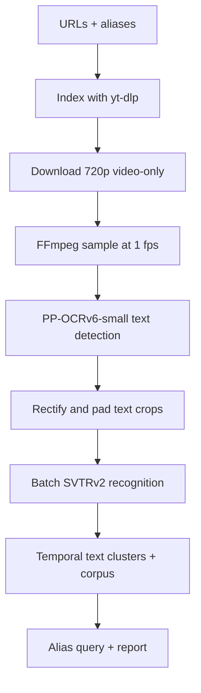

# TF2 YouTube Username Finder — MVP Design

> **Revision 2 (reviewed):** adds immutable scan-run lineage, bounded text-retention rules, explicit observation–cluster links, separate evidence paths, PP-OCRv6-small-rec evaluation, and confidence intervals.

Status: implementation handoff — revised for adaptive text detection  
Primary MVP goal: find likely appearances of one player username (plus aliases) in TF2 gameplay videos and produce timestamps and evidence crops for human review.  
Long-term direction: scan a large video corpus once and let people search it for their own usernames.

## 1. Product definition

Given:

- a curated list of YouTube channels, playlists, or video URLs;
- a date range;
- one target username and optional historical aliases;

the program downloads suitable video-only streams, samples frames, detects text regions across the frame, recognizes those regions with a small OCR model, matches the results against the target aliases, clusters repeated observations, and produces a reviewable report.

Success is not perfect killfeed transcription. Success is high recall for the target name with few enough candidates that a person can quickly verify them.

The scanner must remain **target-independent** even though the MVP exposes a single-name search. OCR results are corpus data; matching a configured username is a downstream query. Useful nonmatching rows must not be discarded, because retaining them makes it possible to add new username searches without rescanning every video.

## 2. MVP scope

### Included

- Known channels, playlists, and individual video URLs
- Date/title/duration filtering
- Video-only downloads at up to 720p
- Full-frame sampling at a configurable rate, initially 1 frame/second
- Fast, HUD-independent text detection with PP-OCRv6-small-det
- Batched recognition with OpenOCR SVTRv2
- Target-independent retention and deduplication of recognized rows
- Exact and fuzzy alias matching
- Temporal clustering and consensus
- SQLite state so jobs can resume
- Evidence crops and a static HTML/JSON report

### Explicitly deferred

- Crawling all of YouTube
- Geographic filtering
- Classification of detected text as killfeed, scoreboard, chat, or spectator UI
- OCR-specific VLM inference on every frame
- Model fine-tuning
- A Flask/FastAPI service or multi-user UI
- A public username-search API and dedicated search engine
- Distributed processing

The MVP should be a local, resumable CLI. A server adds little until the scanner proves useful.

## 3. Core design



Conceptually, ingestion and search are separate:

```text
ingestion: video → detect text → recognize crops → text clusters → corpus
MVP query: corpus → configured alias matcher → candidate hits
later:     corpus → search index/API → many users and usernames
```

The expensive work—download, decode, crop, and OCR—should happen once per video. Changing or adding a username should rerun matching only.

### 3.1 Video discovery and download

Use `yt-dlp` for both metadata extraction and download. For a curated-channel MVP, this avoids a YouTube Data API key and another integration.

Indexing should:

1. Expand each channel or playlist into video records.
2. Persist video ID, URL, channel, title, upload date, duration, and available resolution.
3. Apply configured date, title, and duration filters.
4. Mark records as `pending`, `downloaded`, `scanned`, `failed`, or `skipped`.

Download video only, preferring a stream no larger than 720p. Keep the downloaded file until scanning and report generation succeed, then either delete it or retain it according to configuration. Preserve partial downloads and use a download archive so interrupted runs resume cleanly.

### 3.2 Frame sampling

Use FFmpeg as a subprocess. Sample at 1 fps by default. The decoder should pipe frames to the scanner instead of writing every sampled frame to disk.

One frame/second is intentionally conservative: a killfeed notice normally persists long enough to appear in several samples. Make the rate configurable so crowded clips can be rescanned at 2 fps.

Do not build change detection in V1. A transparent HUD sits over a moving game background, which makes naive frame differencing less helpful than it appears. First measure OCR cost. Add a text-aware change gate only if OCR is actually the bottleneck.

### 3.3 Text detection and crop extraction

SVTRv2 recognizes cropped text but cannot locate it. Use **PP-OCRv6-small-det** to locate text across each sampled frame. Do not attempt to identify the killfeed or classify HUD regions in the MVP; recognizing all detected text also finds useful appearances in scoreboards, chat, killcams, and spectator UI.

PP-OCRv6-small-det is the initial default because it provides a strong accuracy/size tradeoff: PaddleOCR reports a 9.6 MB model and 84.1 detection Hmean on its internal multi-scenario benchmark. The tiny variant is only 1.9 MB but reports 80.6 Hmean; benchmark it as the speed-oriented alternative. Do not compare these numbers directly with unrelated datasets.

Keep detection behind an adapter:

```python
class TextDetector(Protocol):
    def detect(self, frames: list[Image.Image]) -> list[list[Detection]]: ...

@dataclass
class Detection:
    polygon: list[tuple[float, float]]
    confidence: float
```

For every sampled frame:

1. Run PP-OCRv6-small-det over the frame.
2. Retain the polygon and detector confidence for every accepted region.
3. Perspective-rectify each quadrilateral into a horizontal crop.
4. Add a small configurable margin so character strokes are not clipped.
5. Reject implausibly tiny or malformed boxes.
6. Batch the remaining crops through SVTRv2-S.

For 720p input, benchmark native resolution against `limit_type="min", limit_side_len=960`; upscaling may improve small HUD-text recall at additional compute cost. Start with detector defaults, then sweep the box-confidence threshold on the evaluation set. Favor recall slightly over precision because recognition and username matching provide downstream filters.

Use ONNX Runtime GPU as the intended production boundary for both detection and recognition. It avoids loading separate Paddle and PyTorch runtimes. It is acceptable to begin with Paddle's standard detector runtime and PyTorch recognition for correctness, then export after the evaluation harness exists.

Store representative crops and polygons for evidence. Do not persist every sampled frame.

### 3.4 Useful-text retention policy

“Retain all useful recognized text” means retaining every detection that passes a bounded, deterministic filter—not every raw detector proposal.

For each sampled frame:

1. Reject invalid polygons and crops shorter than a configurable minimum source-text height; start with 6 pixels.
2. Deduplicate substantially overlapping proposals before recognition. If polygon IoU is at least 0.85 or one proposal is at least 90% contained by another, keep the higher-confidence proposal.
3. Sort remaining proposals by detector confidence and recognize at most 64 crops per frame by default. Make the cap configurable and record how many proposals were dropped.
4. After recognition, discard empty output, output below a configurable low confidence floor, and strings containing fewer than two Unicode letters or numbers.
5. Assign a coarse normalized screen-region tag from a 3×3 grid (`top_left` through `bottom_right`) and retain normalized polygon dimensions. This is metadata, not semantic HUD classification.
6. Cluster near-identical observations across time. Repeated static HUD text should become one long-lived cluster rather than one searchable corpus entry per sampled frame.

Persist accepted observation metadata while scanning, but retain crop files only for representative observations, borderline matches, and confirmed hits after clusters are finalized. Never silently truncate: per-frame counters must record raw detections, geometric duplicates, recognized crops, accepted observations, and cap-dropped proposals.

These defaults are safety bounds for the vertical slice, not accuracy claims. The evaluation harness should tune minimum height, confidence floor, overlap threshold, and per-frame cap.

### 3.5 OCR model

Use the official OpenOCR SVTRv2 implementation and pretrained weights. Begin implementation with **SVTRv2-S**. Keep inference behind a narrow adapter so T and B variants can be benchmarked without changing the pipeline:

```python
class Recognizer(Protocol):
    def recognize(self, crops: list[Image.Image]) -> list[Recognition]: ...

@dataclass
class Recognition:
    text: str
    confidence: float | None
```

The official OpenOCR benchmark lists the variants below. Its latency was measured on a GTX 1080 Ti with PyTorch dynamic graph mode, so treat it only as a relative reference and measure on the actual machine.

| Model    | Parameters | Published latency | MVP role            |
| -------- | ---------: | ----------------: | ------------------- |
| SVTRv2-T |      5.13M |            5.0 ms | Fastest comparison  |
| SVTRv2-S |     11.25M |            5.3 ms | Initial default     |
| SVTRv2-B |     19.76M |            7.0 ms | Accuracy comparison |

Start with PyTorch for recognition correctness if necessary. Move both detector and recognizer to ONNX Runtime only after the evaluation harness exists; otherwise performance work can hide detection or recognition regressions.

### 3.6 Username matching (MVP query layer)

The matcher consumes stored recognized text regions and should operate on aliases without requiring perfect transcription. It must not control which OCR results are retained.

For every OCR result, retain the raw text and create two normalized forms:

- `conservative`: Unicode NFKC, case-folded, repeated whitespace collapsed;
- `compact`: conservative form with whitespace and common separators removed.

Compare every alias against both forms. Use substring matching first, followed by normalized Levenshtein similarity over sliding windows near the alias length. RapidFuzz is suitable; convert its score to a consistent 0–1 range. A detected line may contain killer, assister, and victim names, so search within the recognized string rather than comparing only the complete string.

Initial decision rules, to be tuned on the evaluation set:

- accept one observation with similarity at least 0.95;
- or accept two observations within 8 seconds with similarity at least 0.82;
- aliases of four characters or fewer require exact normalized matching or a stricter, separately tuned rule;
- retain borderline results in SQLite even when they are not promoted to hits.

Avoid hard-coded character substitutions such as `0 → o` during normalization. They may improve recall but can sharply increase false positives. If useful, treat them as scored edit alternatives.

### 3.7 Temporal clustering

A name visible for several seconds will produce repeated OCR observations. Cluster observations when they:

- come from the same video and spatial neighborhood, using polygon overlap or normalized center distance;
- are no more than 8 seconds apart; and
- have compatible recognized text. Alias agreement may strengthen a cluster but must not be required to create it.

One cluster becomes one candidate hit. Record:

- start and end timestamp;
- best OCR text and score;
- number of supporting frames;
- distinct OCR strings seen across the cluster;
- best full-frame and detected-text-crop evidence;
- direct YouTube timestamp URL.

This both reduces reviewer workload and makes noisy per-frame OCR useful.

Clustering has two outputs:

1. A target-independent `text_cluster`, created for every useful recognized region.
2. An optional target-specific `hit`, created when that cluster matches the current alias query.

Store text clusters even when they do not match the MVP username. Record detector, recognizer, preprocessing, and normalization versions so the corpus can later be rematched, migrated, or selectively reprocessed.

## 4. Storage and outputs

SQLite is sufficient for the MVP. Use migrations from the beginning and keep target-independent corpus records separate from target-specific search results.

```text
videos
  id, source_url, channel_id, title, upload_date, duration_s
  local_path, created_at

scan_runs
  id, started_at, completed_at, status, config_hash
  detector_name, detector_version, detector_weights_hash
  recognizer_name, recognizer_version, recognizer_weights_hash
  preprocessing_version, normalization_version
  software_versions_json, config_json

video_scans
  id, scan_run_id, video_id, status, error
  sample_fps, input_width, input_height
  started_at, completed_at

sampled_frames
  id, video_scan_id, timestamp_s
  raw_detection_count, duplicate_detection_count
  recognition_count, accepted_observation_count, cap_dropped_count
  full_frame_path_nullable

observations
  id, sampled_frame_id, polygon_json
  screen_region, normalized_width, normalized_height
  detector_confidence, raw_text, normalized_text, ocr_confidence
  crop_path_nullable

text_clusters
  id, video_scan_id, start_s, end_s, representative_observation_id
  representative_polygon_json, screen_region
  canonical_text, normalized_text, best_confidence
  support_count

cluster_observations
  cluster_id, observation_id, support_score

hits
  id, text_cluster_id, query_id, matched_alias
  best_text, best_score, support_count
  review_status, reviewer_note, created_at

queries
  id, target_name, aliases_json, matcher_version, created_at
```

`scan_runs` owns every model, preprocessing, normalization, dependency, and configuration version needed to explain or reproduce a scan. `video_scans` links a video to one run. `cluster_observations` makes cluster provenance explicit instead of relying on timestamps or spatial inference.

`sampled_frames.full_frame_path_nullable` and `observations.crop_path_nullable` separate the two evidence types. Most paths should be null after compaction; `text_clusters.representative_observation_id` identifies the crop used as cluster evidence, and its sampled frame identifies the optional full-frame evidence.

`observations` and `text_clusters` form the reusable corpus. `queries` and `hits` are disposable derived data and can be regenerated when aliases or matching logic change. Reprocessing a video creates a new `video_scan` under a new `scan_run`; it does not overwrite the previous lineage.

Generate:

- `results.sqlite3` — authoritative scan state and evidence metadata;
- `text_clusters.jsonl` — optional export of target-independent text clusters;
- `hits.jsonl` — portable machine-readable results;
- `report/index.html` — sortable candidates with crop, video title, score, timestamp link, and confirm/reject state;
- `report/assets/` — only evidence images, not every sampled frame.

The first report may be static. Confirm/reject can export a small JSON file or be handled by a separate CLI command; a server is unnecessary for V1.

Do not retain every sampled frame. Retain compact text-cluster records and representative evidence crops. This keeps the corpus useful for future search without allowing storage to grow at the raw sampling rate.

## 5. Suggested CLI and repository shape

```text
tf2-name-scan/
  pyproject.toml
  config.example.yaml
  src/tf2scan/
    cli.py
    config.py
    indexing.py
    download.py
    frames.py
    detection.py
    crops.py
    recognize.py
    matching.py
    clustering.py
    storage.py
    report.py
  tests/
  eval/
    manifest.jsonl
    run_benchmark.py
```

Suggested commands:

```bash
tf2scan index config.yaml
tf2scan scan --pending
tf2scan scan --video VIDEO_ID --fps 2
tf2scan detect FRAME_PATH --visualize
tf2scan report
tf2scan benchmark eval/manifest.jsonl
```

All stages must be idempotent. A failure in download, decode, or OCR should update that video's state and allow the rest of the queue to continue.

## 6. Evaluation plan

### 6.1 What the dataset should represent

The evaluation unit is a **visible username occurrence**, not an individual frame. Adjacent frames showing the same killfeed notice are one occurrence.

Build two complementary sets:

1. **Demo-rendered set:** cheap, exact event metadata and controlled variation.
2. **Real YouTube set:** manually verified samples covering the actual channels, HUDs, resolutions, motion backgrounds, and compression artifacts that matter.

Split by source demo or source video, never by frame. Otherwise nearly identical neighboring frames leak into both train and test sets and inflate accuracy.

The real-video set does not need to contain the user's actual name. Label the visible names and treat each one as a temporary target during evaluation. This tests the same retrieval behavior without first having to find known appearances of the real target.

### 6.2 Generating the demo-rendered set

1. Collect TF2 POV/STV `.dem` files containing varied player names and combat density.
2. Parse them with the current `demostf/parser` project (the old GitHub repository points to its maintained Codeberg home).
3. Export death events with tick, killer, assister when present, victim, and weapon/event type.
4. Render short windows around selected ticks with SourceDemoRender using varied HUDs and resolutions where practical.
5. Sample rendered frames and run the same detector/crop/recognizer pipeline used by the scanner.
6. Label visible text polygons and player-name strings. Parser output supplies expected names, but automatically generated labels must still be spot-checked because assists, world kills, overlapping notices, name changes, and notice eviction can alter what is actually visible.
7. Deliberately include sequences where new killfeed notices move older notices, older notices expire, several kills occur close together, and the same lobby contains visually similar names such as `HumanWorm`, `HumanW0rm`, and `HurnanWorm`.
8. Create additional 720p compressed versions with FFmpeg to approximate YouTube degradation.
9. Deduplicate neighboring frames and split the dataset by demo.

A useful first benchmark is roughly 500–1,000 labeled text regions, with at least 100 positive name occurrences and a much larger negative set. Add 100–200 manually labeled real YouTube occurrences before treating the benchmark as predictive of production behavior.

Use a small JSONL manifest so every model sees exactly the same data:

```json
{
  "image": "frames/demo_001_123456.png",
  "source_id": "demo_001",
  "visible_names": ["PlayerOne", "HumanWorm"],
  "text_polygons": [
    [
      [812, 24],
      [1012, 24],
      [1012, 47],
      [812, 47]
    ]
  ],
  "scenario_tags": ["notice_shift", "lookalike_names"],
  "hud": "default",
  "resolution": "1280x720",
  "compression": "youtube_like"
}
```

### 6.3 Models to benchmark

Benchmark PP-OCRv6-small-det and PP-OCRv6-tiny-det on the same frames at native 720p and 960 minimum-side processing. Use small as the starting default and switch to tiny only if it provides a material throughput gain without meaningful target-text recall loss.

Benchmark the pretrained English SVTRv2-T, S, and B checkpoints on identical detected crops and batching configuration. Also benchmark **PP-OCRv6-small-rec** as an integration-simplification arm: if it is competitive on target-name recall and throughput, using PP-OCRv6 for both detection and recognition may remove a framework and conversion boundary. SVTRv2-S remains the initial default until the project-specific benchmark says otherwise. Generic OCR benchmark scores are not the decision criterion.

Track:

| Layer         | Metrics                                                                                               |
| ------------- | ----------------------------------------------------------------------------------------------------- |
| Detection     | visible-name region recall, recall for text under 20 pixels tall, false boxes/frame, polygon coverage |
| Recognition   | normalized exact-match accuracy, character error rate, target-alias recall                            |
| Matching      | precision/recall at each fuzzy threshold, score distributions for positives and negatives             |
| End to end    | occurrence recall, video-level recall, false candidate hits per video-hour                            |
| Reviewer cost | candidates requiring review per video-hour                                                            |
| Performance   | crops/second, decoded video-hours/wall-hour, batch latency, peak VRAM/RAM                             |
| Operations    | download bytes/video-hour, temporary disk use, failure/retry rate                                     |

Report results separately by source resolution, HUD, compression severity, text height, alias length, and crowded versus quiet scenes.

Report 95% confidence intervals, not only point estimates. Use Wilson intervals for proportions such as detection and occurrence recall, and a source-group bootstrap (grouped by video or demo) for false candidates per video-hour and other corpus-level rates. With only a few hundred labeled occurrences, do not treat a point estimate above 95% recall or below 0.5 false candidates/hour as confirmation that the corresponding gate has been met.

Provisional MVP gates:

- at least 95% recall on visible target-name occurrences;
- at least 97% detection recall for labeled visible-name regions before recognition;
- no more than 0.5 false candidates per scanned video-hour;
- at least 10× real-time scanning on the target machine, excluding download time;
- interrupted jobs resume without rescanning completed videos.

These are product targets, not assumptions. Early benchmark reports should show their uncertainty and guide dataset expansion; they should not claim the gates are statistically established until the intervals and source coverage support that conclusion.

## 7. Later: uncertain-crop recovery model

Only after benchmarking the small recognizer, add an OCR-specific VLM for ambiguous clusters—for example, HunyuanOCR. It is relevant because its published evaluation explicitly includes game, screen, and video text, and it can return text with coordinates.

Send only uncertain evidence to this model, such as:

- SVTRv2 score near the promotion threshold;
- conflicting strings across adjacent frames;
- a strong fuzzy match supported by only one frame;
- blank SVTRv2 output from a visually nonblank row.

Use the larger model's result as another scored observation, not unquestioned ground truth. Cache every result and measure whether it improves occurrence recall or reduces review burden enough to justify its latency and memory cost. It is not part of the MVP dependency graph.

## 8. Later: TF2-specific fine-tuning

Fine-tune recognition only if the pretrained variants miss the recall target on correctly detected and cropped text. If visible names are never proposed as boxes, fine-tune or replace the detector instead; recognition training cannot repair detection misses.

Use the OpenOCR recognition fine-tuning path with pretrained SVTRv2-S weights. Train on isolated detected-text crops with exact visible text labels. A practical corpus would combine:

- verified demo-rendered rows;
- manually corrected real YouTube rows;
- synthetic TF2 killfeed rows using representative fonts, team colors, icons, backgrounds, scaling, blur, and video compression.

Keep an untouched test split grouped by channel/HUD or demo. Optimize for target-name recall and false candidates per video-hour, not only generic word accuracy. Start by manually auditing 1,000–2,000 automatically produced labels; do not fine-tune directly on unverified parser/render alignment.

## 9. Eventual corpus search

The MVP does not need a search service, but its stored text clusters should support one without re-running detection or recognition.

At larger scale:

1. Export finalized `text_clusters` from SQLite into PostgreSQL or a dedicated search engine.
2. Index both conservative and compact normalized text using character n-grams/trigrams. Player names contain unusual capitalization, punctuation, digits, and Unicode, so ordinary word tokenization is insufficient.
3. Search exact normalized substrings first, then fuzzy candidates within a length-aware edit-distance threshold.
4. Group results by source video and temporal cluster before returning them.
5. Show the original OCR text, evidence crop, confidence, channel/video metadata, and timestamp link so users can verify a result.

A future API can remain small:

```text
GET /search?username=HumanWorm
  → exact hits
  → likely fuzzy hits
  → video, timestamp, crop, OCR text, and confidence
```

The search system should preserve short-name safeguards and rate limits because fuzzy matching a short string can generate many unrelated results. If later processing can reliably separate individual player names within each row, add a derived `name_candidates` index; do not make that extraction a prerequisite for the MVP.

Important corpus invariants:

- A video is identified independently of any query or user.
- Each `video_scan` belongs to exactly one immutable `scan_run`; reprocessing creates a new lineage rather than overwriting old observations.
- Target-independent text clusters are durable; target-specific hits are rebuildable.
- Detector, recognizer, weights, preprocessing, normalization, dependencies, and effective configuration are captured by the owning scan run.
- Every cluster is traceable to its supporting observations through `cluster_observations`.
- Evidence retains source provenance and timestamp information.
- Deleting a source video removes its clusters, index entries, and evidence together.

## 10. Implementation order

1. **Vertical slice:** one local video, FFmpeg sampling, PP-OCRv6-small detection, geometric deduplication and crop caps, crop rectification, SVTRv2-S recognition, explicit useful-text filtering, alias matching, console timestamps.
2. **Lineage, evidence, and clustering:** scan runs, video scans, observation-to-cluster links, separate nullable frame/crop evidence, polygons, confidence values, target-independent text clusters, temporal consensus, SQLite, HTML report.
3. **Acquisition:** yt-dlp indexing/download, filters, retries, resume behavior.
4. **Evaluation:** demo-rendered and real-video manifests; small/tiny detector benchmarks; SVTRv2 T/S/B and PP-OCRv6-small-rec benchmarks; tune thresholds and report confidence intervals.
5. **Deployment:** ONNX Runtime GPU for detector and recognizer after correctness is established.
6. **Scale pass:** batch sizing, throughput tuning, deletion/retention policy, and long-run reliability.

Do not implement the VLM fallback or fine-tuning until the evaluation report shows a specific failure mode they can address.

## 11. Deferred backlog

- Measure Unicode and character-set recall before expanding beyond the curated English-heavy MVP corpus.
- Review bandwidth costs, caching policy, YouTube terms, and takedown/deletion behavior before crawling at large scale or opening the corpus to many users.

## 12. Key references

- [OpenOCR repository](https://github.com/Topdu/OpenOCR)
- [SVTRv2 models, benchmarks, and commands](https://github.com/Topdu/OpenOCR/blob/main/docs/svtrv2.md)
- [OpenOCR recognition fine-tuning](https://github.com/Topdu/OpenOCR/blob/main/docs/finetune_rec.md)
- [PP-OCRv6 technical documentation](https://github.com/PaddlePaddle/PaddleOCR/blob/main/docs/version3.x/algorithm/PP-OCRv6/PP-OCRv6.en.md)
- [PaddleOCR text detection models and API](https://github.com/PaddlePaddle/PaddleOCR/blob/main/docs/version3.x/module_usage/text_detection.en.md)
- [FAST text detector](https://github.com/czczup/FAST)
- [yt-dlp](https://github.com/yt-dlp/yt-dlp)
- [TF2 demo parser — current home](https://codeberg.org/demostf/parser)
- [Archived GitHub mirror of the demo parser](https://github.com/demostf/parser)
- [SourceDemoRender](https://github.com/crashfort/SourceDemoRender)
- [HunyuanOCR](https://github.com/Tencent-Hunyuan/HunyuanOCR)
